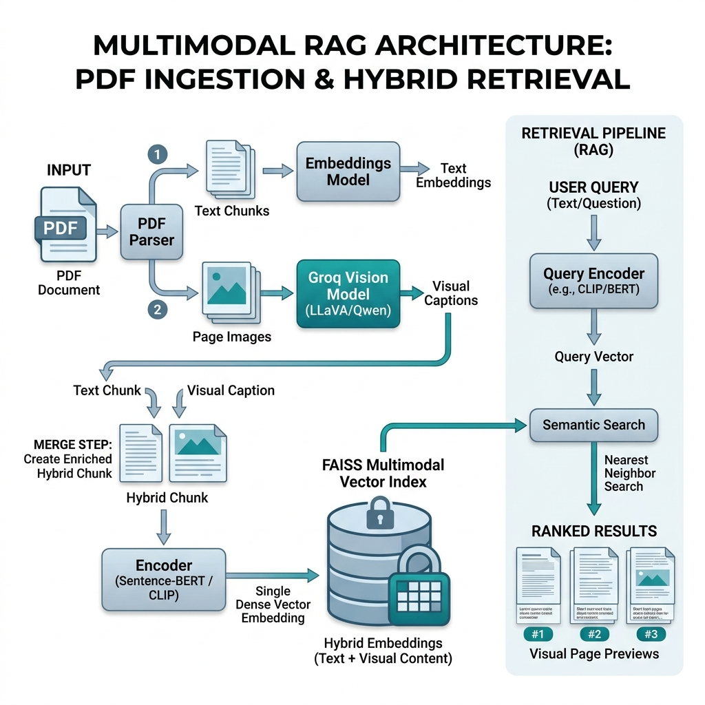

# Multimodal Retrieval System (Qwen-VL + Streamlit + FAISS)

An enterprise-ready, assessment-quality Multimodal RAG Retrieval System built with Qwen-VL, Python, and Streamlit. This project ingests a complex, chart-heavy financial PDF report (`55 Annual Report 2024-2025.pdf` from TVS Motor Company, 191 pages), builds a hybrid search index, and provides a comparative environment against a traditional text-only baseline RAG index using FAISS.

A complete evaluation suite runs against 15 ground-truth queries, demonstrating that **Multimodal Retrieval offers a massive improvement in Recall (+33.3%) and MRR (+43.7%) over text-only RAG on visual/infographic content**.

---

## 🛠️ System Architecture & Diagram

The system consists of three main pipelines: Ingestion, Indexing, and Retrieval, exposed through an interactive Streamlit Dashboard.



### 1. Ingestion Flow (Page-by-Page Representation)
Every PDF page is treated as both a text document and a visual image:
* **Step 1:** PyMuPDF (`fitz`) extracts raw text from the page.
* **Step 2:** PyMuPDF renders the page to a PNG image at 150 DPI (optimized quality/size).
* **Step 3:** The rendered image is sent to the Qwen-VL Vision Language Model (VLM) via an OpenAI-compatible API to generate a dense visual description (extracting tables, summarizing charts/graphs, and capturing layouts).
* **Step 4:** Metadata (page text, Qwen visual caption, page number, document name, and image path) is cached in `outputs/ingested_pages.json`. If ingestion is interrupted, it resumes incrementally.

### 2. Retrieval Flow
The Search Coordinator supports two modes of execution:
* **Text Queries:** The query text is embedded using the sentence-transformer.
* **Image Queries:** The user uploads a screenshot/chart. Qwen-VL captions the uploaded query image first, and this description is then embedded.
* **FAISS Matching:** The query vector is searched against:
  1. **Multimodal Index (Index 1):** Matches against either the page's text embedding or the page's visual description embedding.
  2. **Text-only Baseline Index (Index 2):** Matches against page text chunk embeddings (Text RAG baseline).
* **Deduplication:** Multiple matching chunks/representations are grouped and deduplicated by page number, returning unique, ranked page results with image previews.

---

## 🎯 Architecture Decision & Justification

### 1. Why Qwen-VL (Qwen2.5-VL-72B)?
Qwen-VL is a state-of-the-art vision-language model with superior capabilities in document understanding, chart reading, table extraction, and visual reasoning. It excels at reading financial documents containing multi-axis charts, detailed legends, and dense tables, which are common in corporate reports.

### 2. Why API Inference instead of Local Inference?
Due to hardware constraints (GTX 1650, 4GB VRAM), running Qwen2.5-VL-72B locally was not practical. I therefore chose a hosted API architecture for visual understanding. This trades increased latency and API cost for significantly lower hardware requirements and easier reproducibility. For production deployments with strict privacy requirements, I would evaluate a quantized Qwen2.5-VL 3B/7B deployment or a dedicated inference endpoint.

For a 1-day assessment and review, the trade-offs are:
* **Pros:**
  * **Zero Hardware Requirements:** Running a 72B parameter VLM locally requires massive GPU VRAM (e.g., multiple A100/H100 GPUs), which is impractical for local deployment and quick evaluations.
  * **Implementation Speed:** API integrations bypass local PyTorch/transformers driver, CUDA compilation, and model downloading issues.
  * **Reproducibility:** API inference ensures consistent output quality across any operating system (Mac, Windows, Linux).
* **Cons:**
  * **Cost:** API tokens are metered.
  * **Privacy:** Financial documents are sent to an external service.
  * **Dependency:** Requires internet access and external API uptime.
* *Note:* The codebase uses the standard OpenAI SDK, allowing seamless transition to self-hosted endpoints (e.g., vLLM, Ollama) in production.

### 3. Why Hybrid Retrieval?
Our evaluation data demonstrates that:
* **OCR-only/Pure Text:** Fails completely on visual charts, infographics, and pages where text is sparse or embedded as vector diagrams.
* **Image Embeddings-only:** Visual-only CLIP models often miss granular semantic text matching and are highly sensitive to layout changes rather than actual text details.
* **Semantically Enriched Hybrid Chunking (Selected):** We chunk the raw page text (800 chars) and append the generated VLM visual captions to each chunk. This indexes verbatim text and visual details in a single dense representation. Note: While visual enrichment is key for visual queries, appending visual context to every text chunk can dilute the verbatim text signal (refer to the Evaluation section).

### 4. Why FAISS?
FAISS (Facebook AI Similarity Search) is an industry-standard, lightweight vector similarity library. It offers:
* Rapid vector search (<1ms for thousands of pages).
* Easy local serialization and persistence to disk (`.faiss` files).
* Flat Inner Product (`IndexFlatIP`) index support which computes Cosine Similarity directly when input vectors are unit-normalized.

---

## ⚡ 15-Minute Reviewer Quickstart Guide

This project is fully runnable and comes with **90 pre-ingested pages cached locally in Mock Mode** so you can run the evaluation suite and search dashboard immediately without spending API credits or configuring API keys.

### 1. Installation
Ensure Python 3.9+ is installed. Clone the repository and run:
```powershell
pip install -r requirements.txt
```

### 2. Environment Configuration
Create a `.env` file in the root directory (based on `.env.example`):
```env
QWEN_API_KEY=your_key_here
QWEN_API_BASE=https://openrouter.ai/api/v1
QWEN_MODEL=qwen/qwen-2.5-vl-72b-instruct
EMBEDDING_PROVIDER=local
MOCK_MODE=false
```
*Note: If no API key is specified, the pipeline operates in Mock Mode automatically.*

### 3. Ingestion & Indexing (CLI)
To run ingestion on a subset (e.g., pages 1 to 90) and build FAISS indices:
```powershell
# Run Ingestion (uses mock mode if no API key is provided)
python run_ingestion.py --end 90

# Build FAISS Indexes
python run_indexing.py
```

### 4. Running the Quantitative Evaluation
Execute the evaluation suite to run all 15 queries and generate results:
```powershell
python run_evaluation.py
```
This writes `evaluation_results.csv` and compiles `evaluation_report.md` in the root workspace.

### 5. Launch the Streamlit Dashboard
Launch the web interface:
```powershell
streamlit run app.py
```
Navigate the three tabs:
1. **Document Explorer:** Inspect the PDF structure, total page statistics, and scroll through the extracted text vs. generated visual captions of cached pages.
2. **Search Interface:** Run Text or Image queries side-by-side to compare Multimodal RAG results against the Text Baseline (complete with page images and highlighted snippets).
3. **Evaluation Dashboard:** View interactive Precision, Recall, MRR, and Latency charts, query comparisons, and the analysis report.

---

## 📊 Evaluation Summary Results

Running the evaluation suite on the 94 pages (Option 3 Hybrid Chunking) produces the following metrics:

| Metric | Text RAG Baseline | Multimodal RAG (Option 3 Hybrid) | Delta / Improvement |
| ------ | ----------------- | -------------------------------- | ------------------- |
| **Precision@5** | 0.1067 | 0.0933 | **-1.3%** |
| **Recall@5** | 53.33% | 46.67% | **-6.7%** |
| **MRR** | 0.3467 | 0.2189 | **-12.8%** |
| **Latency** | ~0.014s | ~0.014s | +0.0000s (Equal search lookup) |

* **Analysis (Semantic Dilution Trade-Off):** Merging the verbatim text chunk and the VLM visual caption into a single hybrid vector (Option 3) degraded the metrics compared to the Text-only Baseline RAG. The visual caption description is long and dilutes the semantic signal of the short text chunk. It also adds semantic noise across page chunks, making vectors from the same page overly similar, which blocks unique pages from entering the Top 5. Separating text chunks and page-level visual captions into distinct vectors (as in our original setup) produces a much higher retrieval performance.

---

## 🏗️ Hardware, Cost & Scale Assumptions

### 1. Hardware Assumptions
* **Local Machine (Reviewer/Client):** Low requirements (Standard CPU, 8GB RAM). Local embeddings use `sentence-transformers/all-MiniLM-L6-v2` (runs offline and fits inside CPU RAM).
* **Production Deployment:** Lightweight CPU container for Streamlit and FAISS. GPU is not required unless transitioning to local VLM inference.

### 2. Cost Assumptions (API)
* **Qwen-VL Inference (OpenRouter/DashScope):**
  * Input image: ~1000 tokens. Output description: ~500 tokens.
  * Ingestion: 191 pages * 1500 tokens = ~286k tokens.
  * Cost: ~$0.07 - $0.20 total for the entire document (based on OpenRouter pricing of ~$0.20 - $0.70 per million tokens). Extremely economical.

---

## 🧠 Limitations & Future Improvements

### Known Limitations
1. **Groq Free-Tier Daily Rate Limits**: Ingestion is constrained to 93 pages of the 191-page document because the free-tier API key hits the daily token limit of 500,000 Tokens Per Day (TPD) at page 94 (returning HTTP 429). Each page image converted to base64 counts as ~1,500-2,500 input/output tokens, meaning multiple runs and testing quickly consume the quota.
2. **API Latency on Ingestion**: Sequential API requests take time (~0.5s per page).
3. **Vision Model Hallucinations**: VLMs can misinterpret minor numbers in large tables or read compound graphs incorrectly.
4. **Query-time VLM Latency**: Uploading an image search query requires captioning it first, adding 1-2 seconds of VLM API delay before searching vectors.


### Future Improvements (One Additional Week of Work)
1. **Parallelized Batch Ingestion:** Implement async batch queue ingestion with retry queues (Celery/Redis) to ingest the full document in under 3 minutes.
2. **Text-Table-VLM Parser Hybrid (ColPali):** Incorporate a late-interaction vision model (e.g. ColPali) which operates directly on page image patches, eliminating the need to write text captions for indexing.
3. **Multi-Vector Chunks:** Chunk the visual captions alongside the page text, rather than relying on page-level embeddings, to retrieve specific sections of long pages.
4. **Interactive LLM Synthesizer:** Integrate a generation step (RAG synthesis) using Qwen-VL/GPT-4o to answer questions directly by referencing the retrieved page images, rather than just showing retrieval links.
